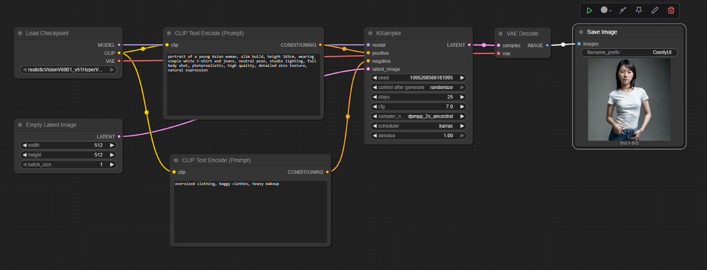

# Virtual Fashion Fitting with Comfy UI

Демонстрация виртуальной примерки одежды на различных типах телосложения с помощью ComfyUI и LoRA моделей.
Этот проект демонстрирует, как одна и та же модель одежды выглядит на трех различных типах женского телосложения:

- **Азиатский тип**: стройное телосложение
- **Российский тип 1**: среднее телосложение
- **Российский тип 2**: спортивное/крупное телосложение

## Результаты

### До и После
| Тип фигуры | Базовое изображение | С одеждой | Примечания |
|:----------:|:-------------------:|:---------:|:----------:|
| Азиатский (Slim) |  |  | Подгонка для стройной фигуры |
| Российский (Medium) |  |  | Стандартная посадка |
| Российский (Curvy) |  |  | Адаптация для крупной фигуры |

## Технические детали

### Использованные модели
- **Base Model**: Realistic Vision V6.0 B1
- **LoRA Models**: C1_Office_Dress_By_Stable_Yogi
- **VAE**: SD VAE (840000-ema-pruned)

### Настройки генерации
- **Размер**: 512x512
- **Steps**: 25
- **CFG Scale**: 7
- **Sampler**: DPM 2S ancestral Karras

## Workflows

### Базовые фигуры
| Тип фигуры | Workflow Screenshot | JSON файл |
|:----------:|:-------------------:|:---------:|
| Азиатский (Slim) |  | [asian-slim.json](workflows/asian-slim.json) |
| Российский (Medium) |  | [russian-medium-base.json](workflows/russian-medium-base.json) |
| Российский (Curvy) |  | [russian-curvy-base.json](workflows/russian-curvy-base.json) |

### Примерка одежды
| Тип фигуры | Workflow Screenshot | JSON файл |
|:----------:|:-------------------:|:---------:|
| Азиатский с деловым стилем (Slim) |  | [suit-asian-slim.json](workflows/suit-asian-slim.json) |
| Российский с деловым стилем (Medium) |  | [suit-russian-medium.json](workflows/suit-russian-medium.json) |
| Российский с деловым стилем (Curvy) |  | [suit-russian-curvy.json](workflows/suit-russian-curvy.json) |

## Структура

**virtual-fitting-project/**
- **workflows/** – все файлы для ComfyUI  
  - **screenshots/** – скриншоты настроек workflow  
  - **base-figures/** – JSON-файлы workflow для генерации базовых фигур без делового стиля
    - `asian-slim.json`  
    - `russian-medium-base.json`  
    - `russian-curvy-base.json`  
  - **clothing-fitting/** – JSON-файлы workflow для генерации фигур с деловым стилем
    - `suit-asian-slim.json`  
    - `suit-russian-medium.json`  
    - `suit-russian-curvy.json`  
- **images/** – сгенерированные изображения  
  - **base-figures/** – базовые изображения без делового стиля  
  - **fitted-results/** – результаты с примеркой делового стиля  
- **prompts/** – текстовые промпты для генерации  
  - `base-figures-prompts.txt` – промпты для генерации без делового стиля  
  - `dressed-figures-prompts.txt` – промпты для генерации с деловым стилем  

## Руководство по запуску

1. Установите ComfyUI
2. Скачайте необходимые модели:
   - [Realistic Vision V6.0 B1](https://civitai.com/models/4201/realistic-vision-v51)
   - [C1_Office_Dress_By_Stable_Yogi (LoRA)](https://civitai.com/models/285699/officedresscollectionbystableyogi)
   - [SD VAE (840000-ema-pruned)](https://huggingface.co/stabilityai/sd-vae-ft-mse-original/blob/main/vae-ft-mse-840000-ema-pruned.safetensors)
3. Импортируйте workflow файлы из папки `workflows/` в ComfyUI
4. Используйте промпты из папки `prompts/`
5. При необходимости сверьтесь со скриншотами workflow для правильной настройки
